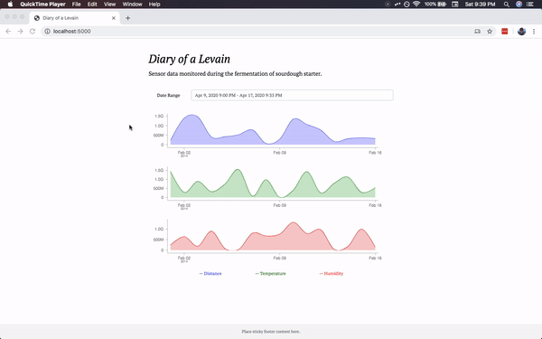
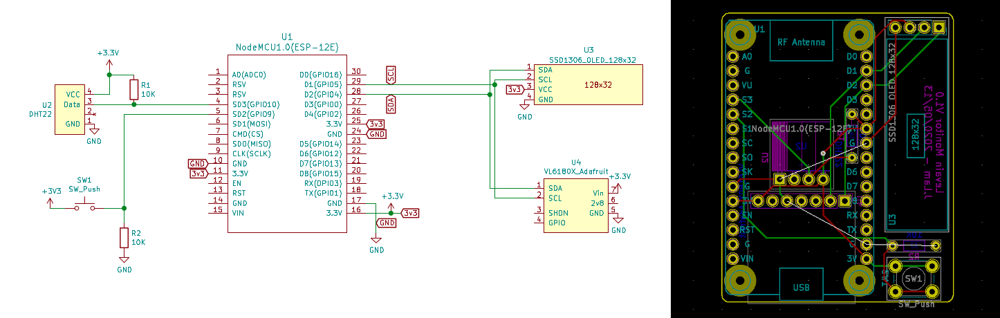
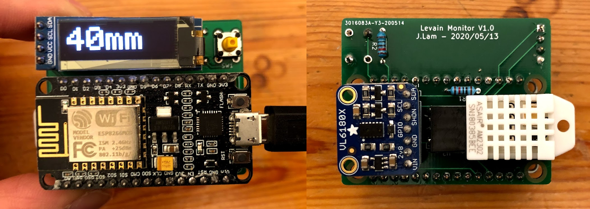

# IoT Sourdough Starter Monitor

Internet connected sourdough starter monitor. Tracks fermentation with distance, temperature, and humidity sensors, and publishes data to the cloud.

<p align="center">
    <br>
    <i>Web app demo with dummy data.</i>
</p>


<p align="center">
    <br>
    <i>PCB schematic and layout in KiCad.</i>
</p>


<p align="center">
    <br>
    <i>Assembled PCB.</i>
</p>

## Hardware

- NodeMCU ESP8266 (aka NodeMCU 1.0 ESP-12E)
- DHT22 Temperature and humidity sensor
- VL6180X Time of flight distance sensor
- SSD1306 Monochrome 128x32 I2C OLED display

## Software

AWS is used as the cloud backend. Data flow is as follows:

- ESP8266 sends sensor data over MQTT
- Kinesis Firehose receives data
- Lambda function puts data from Firehose to S3 on data receive event
- Web app queries S3 data via Athena


## Getting Started

### PlatformIO

This project is built using PlatformIO. To build:

```bash
# Build
pio run

# Build and upload
pio run -t upload
```

To view the serial monitor:

```bash
pio device monitor -b 115200
```

To run the tests:

```bash
# Run tests on device
pio test

# Run tests locally
pio test -e native
```

## Heroku

To deploy the web app to Heroku:

```
git subtree push --prefix webapp heroku master
```

## AWS IoT Certificates

Convert the certificates from AWS to `.der` files, then place them in `data/` (within the project directory).

```bash
openssl x509 -in xxx-certificate.pem.crt -out cert.der -outform DER
openssl rsa -in xxx-private.pem.key -out private.der -outform DER
openssl x509 -in AmazonRootCA1.pem -out ca.der -outform DER
```

Use the following command to upload the files to the SPIFFS filesystem:

```bash
pio run -t uploadfs
```

Alternatively, you may use the [arduino-esp8266fs-plugin](https://github.com/esp8266/arduino-esp8266fs-plugin) to upload the files.
